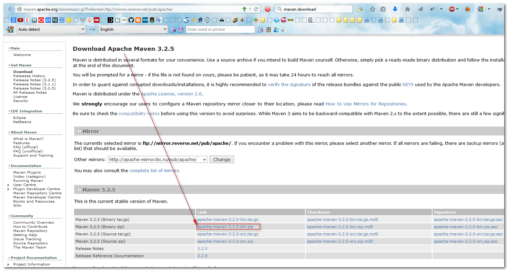
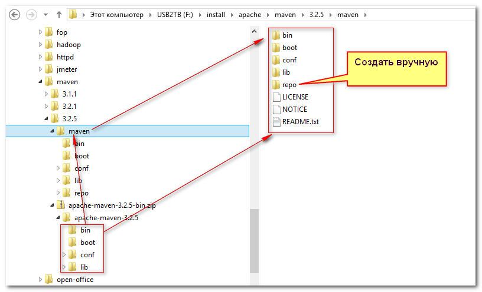
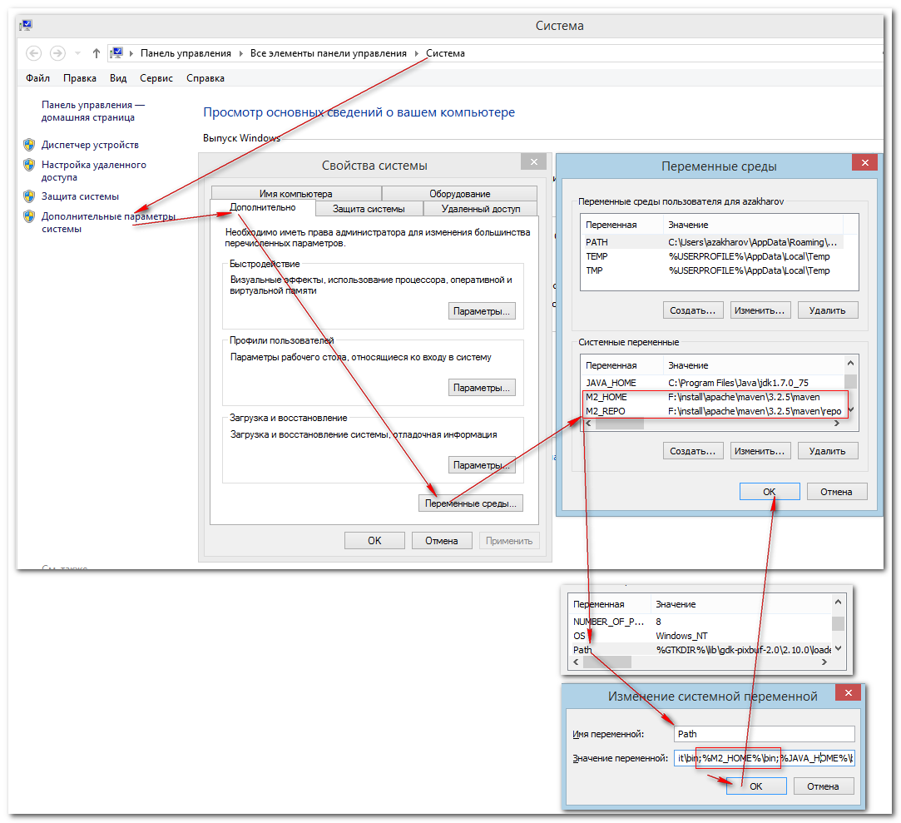
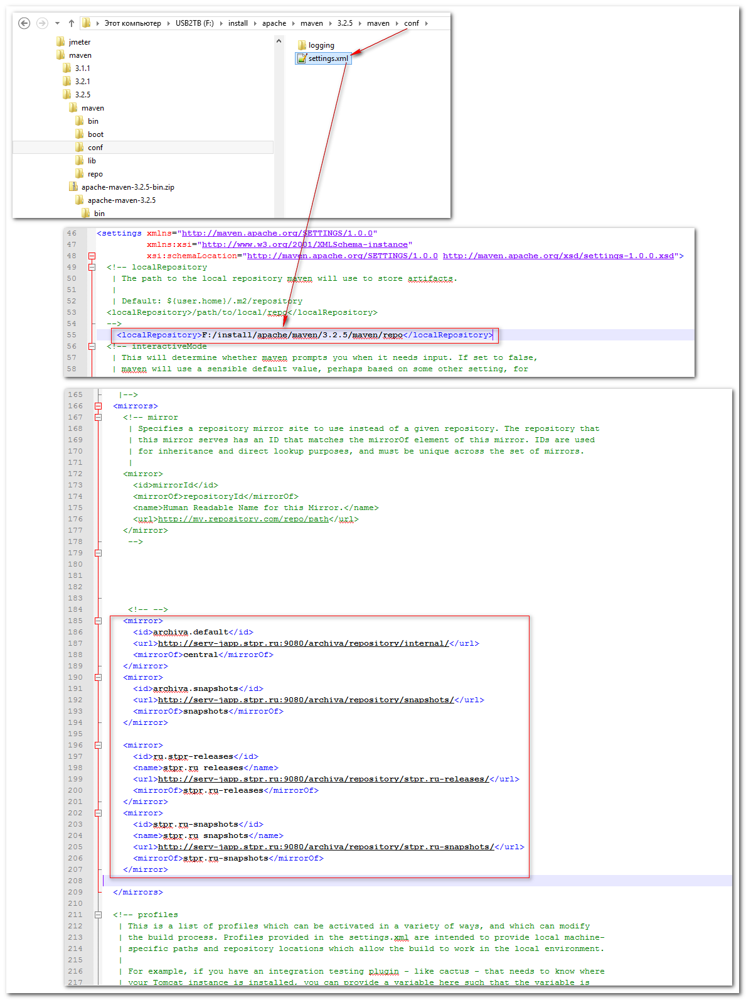

# Настройка maven для Стройпроекта
Created Wednesday 11 March 2015

Предварительные требования
==========================

Наличие JDK (скачать можно на сайте oracle http://www.oracle.com/technetwork/java/javase/downloads/index.html)

Установленная системная переменная JAVA_PATH


Скачать maven и распаковать
===========================

Мавену не требуется специальная установка, достаточно скачать и распаковать его в определённый директорий.

http://maven.apache.org/download.cgi?Preferred=ftp://mirror.reverse.net/pub/apache/
	
Для windows:
	


Распаковать его в каталог:



F:\install\apache\maven\3.2.5\maven
	


Настройка системных переменных
==============================

Настроить три системных переменных:

M2_HOME

M2_REPO (нужна для eclipse)

И PATH:



Добавить настройки в конфигурационный файл maven:

Ссылка на локальный репозиторий (по умолчанию {Профиль пользователя}\.m2)

```xml
	<localRepository>F:/install/apache/maven/3.2.5/maven/repo</localRepository>
```

Ссылка на зеркала зависимостей (dependencies) и зеркала локальных пакетов (разрабатываемых в стройпроекте http://serv-japp.stpr.ru:9080/archiva ):

```xml
	<mirror>
	  <id>archiva.default</id>
	  <url>http://serv-japp.stpr.ru:9080/archiva/repository/internal/ </url>
	  <mirrorOf>central</mirrorOf>
	</mirror>
	<mirror>
	  <id>archiva.snapshots</id>
	  <url>http://serv-japp.stpr.ru:9080/archiva/repository/snapshots/ </url>
	  <mirrorOf>snapshots</mirrorOf>
	</mirror>
	<mirror>
	  <id>ru.stpr-releases</id>
      <name>stpr.ru releases</name>
	  <url>http://serv-japp.stpr.ru:9080/archiva/repository/stpr.ru-releases/ </url>
	  <mirrorOf>stpr.ru-releases</mirrorOf>
	</mirror>
	<mirror>
	  <id>stpr.ru-snapshots</id>
      <name>stpr.ru snapshots</name>
	  <url>http://serv-japp.stpr.ru:9080/archiva/repository/stpr.ru-snapshots/ </url>
	  <mirrorOf>stpr.ru-snapshots</mirrorOf>
	</mirror>
```

В файле pom.xml необходимо прописать профиль с указанием на репозитории зависимостей:

```xml
        <!--
            Для использования внутреннего репозитория maven необходимо выполнить настройку <maven>/conf/settings.xml
            В разделе mirrors добавить:
            <server>
                <id>stpr.ru-releases</id>
                <username>[имя пользователя в репозитории maven]</username>
                <password>[пароль в репозитории]</password>
            </server>
            <server>
                <id>stpr.ru-snapshots</id>
                именно эти имя пользователя и пароль используются для публикации snapshot-а во внутреннем репозитории
                <username>[имя пользователя в репозитории maven]</username>
                <password>[пароль в репозитории]</password>
            </server>
        -->
        <profile>
            <id>stpr.ru-repository</id>
            <activation>
                <activeByDefault>true</activeByDefault>
            </activation>
            <!-- Куда публиковать релизные версии разрабатываемых артифактов -->
            <distributionManagement>
                <repository>
                    <!-- В файле <maven>/conf/setting.xml должен быть такой же <servers>/<server><id>-шник с именем и паролем пользователя с правами на добавление -->
                    <id>stpr.ru-releases</id>
                    <url>http://serv-japp.stpr.ru:9080/archiva/repository/stpr.ru-releases/</url>
                </repository>
                <!-- Куда публиковать snapshot-версии разрабатываемых артифактов. Команда для публикации "mvn deploy" -->
                <snapshotRepository>
                    <!-- В файле <maven>/conf/setting.xml должен быть такой же <servers>/<server><id>-шник с именем и паролем пользователя с правами на добавление -->
                    <id>stpr.ru-snapshots</id>
                    <url>http://serv-japp.stpr.ru:9080/archiva/repository/stpr.ru-snapshots/</url>
                    <uniqueVersion>true</uniqueVersion> <!-- Генерировать уникальный идентификатор snapshot-а при каждом "mvn deploy". При применении можно указать конкретный snapshot (если нужно) -->
                </snapshotRepository>
            </distributionManagement>
            <!-- Сторонние репозитории, откуда удовлетворять зависимости, плагины, а также опубликованные артификаты-->
            <repositories>
                <!-- Репозиторий для релизных версий используемых артифактов (для разрешения зависимостей проекта) -->
                <repository>
                    <id>stpr.ru-releases</id>
                    <url>http://serv-japp.stpr.ru:9080/archiva/repository/stpr.ru-releases/</url>
                    <!-- Флаги типов доступных зависимостей (релизы или snapshot-ы) -->
                    <snapshots>
                        <!-- snapshot-ов в данном репозитории нет -->
                        <enabled>false</enabled>
                    </snapshots>
                    <releases>
                        <enabled>true</enabled>
                    </releases>
                </repository>
                <!-- Репозиторий для snapshot-ов (временные версии) -->
                <repository>
                    <id>stpr.ru-snapshots</id>
                    <url>http://serv-japp.stpr.ru:9080/archiva/repository/stpr.ru-snapshots/</url>
                    <!-- Флаги типов доступных зависимостей (релизы или snapshot-ы) -->
                    <!-- В этом репозитории есть только snapshot-ы. Релизов нет -->
                    <snapshots>
                        <enabled>true</enabled>
                    </snapshots>
                    <releases>
                        <enabled>false</enabled>
                    </releases>
                </repository>
            </repositories>
        </profile>
```

Завершение
==========

Теперь можно запускать сборки

mvn .......